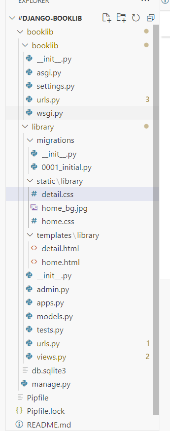

# -Django-BooksLib
Meeting Planner with Django Framework, HTML, CSS

# -To Create Virtualenv
pip install pipenv
 
pipenv shell #to activate venv

# -To Install Django
pip install Django
or
pipenv install django

# -To Create django project
django-admin startproject <project_name>
 
EX:
django-admin startproject booklib

# -To run django server
 
cd meeting_plan
 
python manage.py runserver

# -To create an application inside of the project
python manage.py startapp library

# -To show the list of migrations
python manage.py showmigrations

# -To create default tables with migrations
python manage.py migrate

# -To create migrations
python manage.py makemigrations

# -To convert migrations to the sql query from migration file
python manage.py sqlmigrate meetings 0001

# -To create super user in the admin
python manage.py createsuperuser
 
username: booklib
 
email: booklib@gmail.com
 
password: booklib

# -Folder Structure

